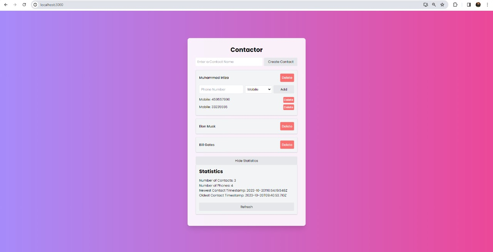

---

# Contactor: React Contacts App

  
*Add a screenshot of your app by replacing `path_to_screenshot_here.png` with the actual path*

## Overview

Contactor is a modern React-based web application designed to manage contacts. Built with a microservices architecture, it ensures scalability and maintainability. The application is dockerized, ensuring smooth deployment. With Tailwind CSS, the UI is clean, responsive, and highly customizable.

## Features

- **Add Contacts:** Easily add new contacts with names and phone numbers.
- **Delete Contacts:** Remove contacts that are no longer needed.
- **Statistics:** View statistics about your contacts, such as the total number of contacts and the newest contact added.
- **Responsive Design:** Thanks to Tailwind CSS, the application is mobile-friendly and looks great on all devices.
- **Microservices Architecture:** Designed for scalability.
- **Docker Integration:** Ensures smooth deployment across various platforms.

## Tech Stack

- React
- Tailwind CSS
- PostgreSQL
- Docker
- Nginx
- REST API

## Folder Structure
- api: Contains the backend services and APIs.
- frontend: Contains the frontend React application.
- src: The main source code directory for the React app.
- nginx: Configuration for the NGINX server.


## Getting Started

### Prerequisites

- Docker
- Node.js (for local development without Docker)

### Installation

1. Clone the repository:
   ```sh
   git clone https://github.com/mirtiza09/React-Contacts-App.git
   ```

2. Navigate to the project directory:
   ```sh
   cd React-Contacts-App
   ```

3. If using Docker, build and run the application:
   ```sh
   docker-compose up --build
   ```

   If not using Docker, navigate to the frontend directory and install dependencies:
   ```sh
   cd frontend
   npm install
   ```

   Then, start the application:
   ```sh
   npm start
   ```

## Contribution

Feel free to fork this repository, create a feature branch, and submit a pull request. All contributions are welcome!

## License

This project is licensed under the MIT License. See the `LICENSE` file for more details.

---
